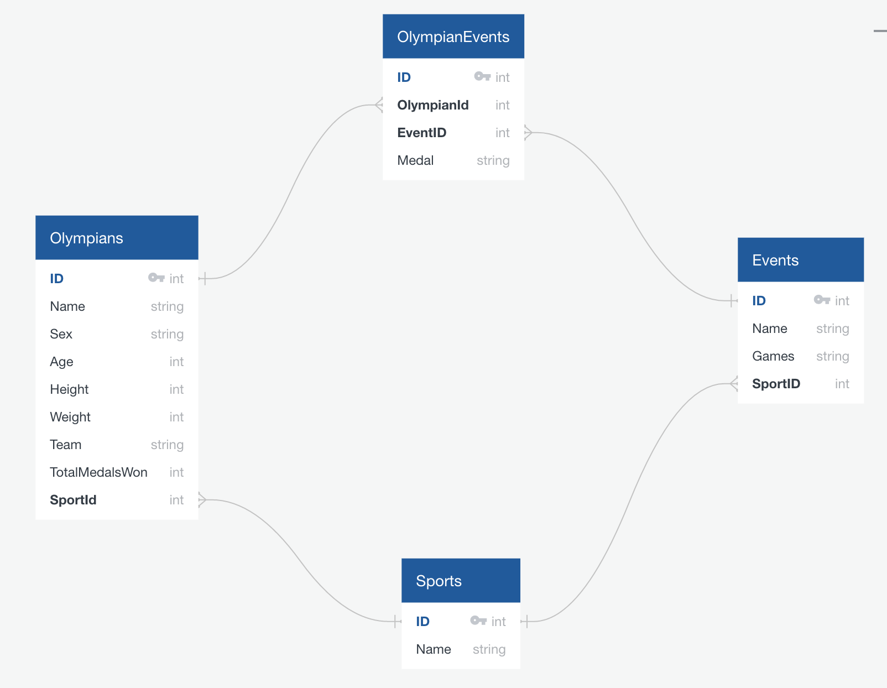

## Koroibos API

### Overview
Koroibos API is a 48 hour solo project for Module 4 at Turing School of Software and Design, made by [Rob Stringer](https://github.com/mycobee).  The project implements the Ruby on Rails framework to build a RESTful API returning olympian and event information.  A Postgres database with many to many schema holds olympians and events information to track athletic performance.  Testing is thorough with RSpec and coverage is measured with simplecov.

### Setup

**Git Setup**
```
$ git clone https://github.com/Mycobee/koroibos_api
$ cd koroibos_api
$ bundle install
```
**Database & Models**  
```
$ bundle exec db:create  
$ bundle exec db:migrate  
$ rails import:data
$ rails set_medals:data
```
**Testing and Coverage**
```   
$ bundle exec rspec
$ open coverage/index.html
```
### Production Links
###### [Backend API](https://powerful-ridge-89081.herokuapp.com/api/v1/olympians)

### Versions

`Rails 5.2.3`  
`Ruby 2.6.3`  

### Testing
RSpec was used to test all endpoints.  Edge cases were also covered, as well as many status codes for different scenarios.    

### Schema


### Tech Stack
* Ruby on Rails
* RSpec
* SimpleCov


### Project Boards
###### [Project Board](https://github.com/Mycobee/koroibos_api/projects/1)

### Endpoints  

#### Returns all olympians

Request:
```
GET /api/v1/olympians
Content-Type: application/json
Accept: application/json
```
Response:
```
{
  "olympians":
    [
      {
        "name": "Maha Abdalsalam",
        "team": "Egypt",
        "age": 18,
        "sport": "Diving"
        "total_medals_won": 0
      },
      {
        "name": "Ahmad Abughaush",
        "team": "Jordan",
        "age": 20,
        "sport": "Taekwondo"
        "total_medals_won": 1
      },
      {...}
    ]
}
```

#### Returns oldest olympian

Request:
```
GET /api/v1/olympians?age=oldest
Content-Type: application/json
Accept: application/json
```
Response:
```
status: 200
body:
{
  [
    {
      "name": "Julie Brougham",
      "team": "New Zealand",
      "age": 62,
      "sport": "Equestrianism"
      "total_medals_won": 0
    }
  ]
}
```

#### Returns youngest olympian

Request:
```
GET /api/v1/olympians?age=youngest
Content-Type: application/json
Accept: application/json
```
Response:
```
status: 200
body:
 {
  [
    {
      "name": "Ana Iulia Dascl",
      "team": "Romania",
      "age": 13,
      "sport": "Swimming"
      "total_medals_won": 0
    }
  ]
}
```

#### Get Olympian Stats

Request:
```
GET api/v1/olympian_stats
Content-Type: application/json
Accept: application/json
```
Response:
```
status: 200
body:
{
    "olympian_stats": {
      "total_competing_olympians": 3120
      "average_weight:" {
        "unit": "kg",
        "male_olympians": 75.4,
        "female_olympians": 70.2
      }
      "average_age:" 26.2
    }
  }
```

#### Get all Events by Sport
Request:
```
GET api/v1/events
Content-Type: application/json
Accept: application/json
```
Response:
```
status: 200
body:
{
  "event": "Badminton Mixed Doubles",
  "medalists": [
      {
        "name": "Tontowi Ahmad",
        "team": "Indonesia-1",
        "age": 29,
        "medal": "Gold"
      },
      {
        "name": "Chan Peng Soon",
        "team": "Malaysia",
        "age": 28,
        "medal": "Silver"
      }
    ]
}
```

#### Returns all medalists for an event
Request:
```
GET api/v1/events/:id/medalists
Content-Type: application/json
Accept: application/json
```
Response:
```
status: 200
body:
{
  "event": "Badminton Mixed Doubles",
  "medalists": [
      {
        "name": "Tontowi Ahmad",
        "team": "Indonesia-1",
        "age": 29,
        "medal": "Gold"
      },
      {
        "name": "Chan Peng Soon",
        "team": "Malaysia",
        "age": 28,
        "medal": "Silver"
      }
    ]
}
```
